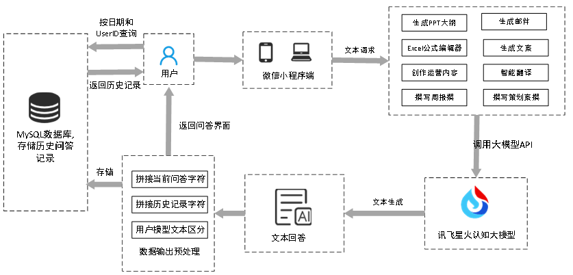
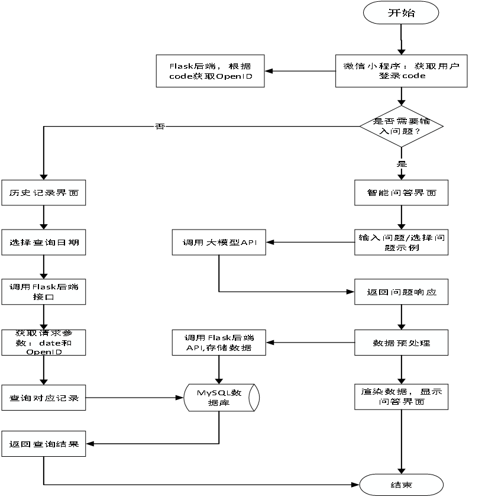

职场助手前后端部署
---

整体框架介绍：

系统流程：

小程序端
---
uniapp地址下，微信开发者工具导入项目即可

后端
---
create_tables.py 文件用于创建数据库表

app.py 文件
- 在 DEEPSEEK_API_KEY 变量中填写你的 API KEY
- 在 db_config 中配置数据库连接信息
- 运行 app.py 即可

其余文件为测试文件不重要

效果展示
---

